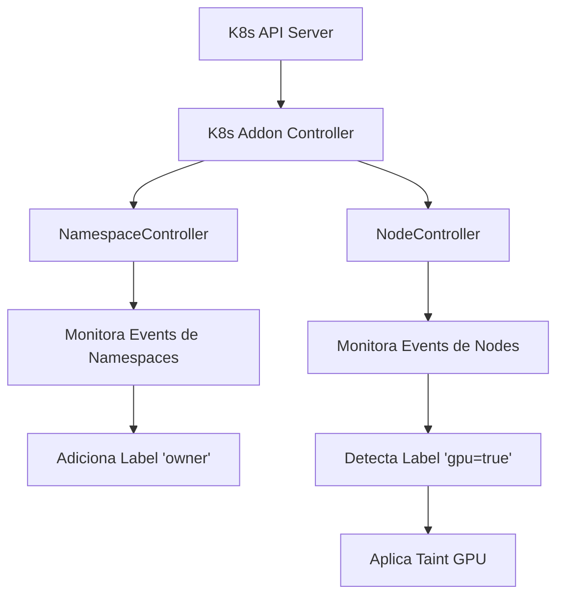

# K8s Addon - Controlador Kubernetes para Gestão Automática

[](https://golang.org/)
[](https://kubernetes.io/)

## 📋 Visão Geral

O **K8s Addon** é um controlador Kubernetes desenvolvido em Go que automatiza tarefas de gerenciamento de cluster através de dois controladores principais:

- **🏷️ NamespaceController**: Adiciona automaticamente labels de proprietário (`owner`) a todos os namespaces do cluster
- **🖥️ NodeController**: Detecta nodes com GPUs e aplica automaticamente taints para isolamento de workloads

## 🏗️ Arquitetura

### Componentes Principais

```
k8s-addon/
├── cmd/addon/           # Ponto de entrada da aplicação
├── internal/
│   └── controllers/     # Implementação dos controladores
├── manifests/           # Manifestos Kubernetes (RBAC + Deployment)
├── Dockerfile           # Containerização
└── Makefile            # Automação de build e deploy
```

### Fluxo de Funcionamento



## 🚀 Funcionalidades

### 1. NamespaceController

**Objetivo**: Garantir que todos os namespaces tenham um label de proprietário consistente.

**Comportamento**:

- Monitora eventos de criação/atualização de namespaces
- Adiciona automaticamente o label `owner: platform` (configurável)
- Operação idempotente - não sobrescreve labels existentes com o mesmo valor

**Configuração**:

```yaml
env:
  - name: OWNER_LABEL_KEY
    value: 'owner' # Chave do label (padrão: owner)
  - name: OWNER_LABEL_VALUE
    value: 'platform' # Valor do label (padrão: platform)
```

### 2. NodeController

**Objetivo**: Automatizar a aplicação de taints em nodes com recursos GPU.

**Comportamento**:

- Monitora eventos de criação/atualização de nodes
- Detecta nodes com label `gpu=true` (configurável)
- Aplica automaticamente o taint `nvidia.com/gpu=true:NoSchedule` (configurável)
- Permite isolamento automático de workloads GPU

**Configuração**:

```yaml
env:
  - name: GPU_NODE_LABEL_KEY
    value: 'gpu' # Label para detectar nodes GPU
  - name: GPU_NODE_LABEL_VALUE
    value: 'true' # Valor do label GPU
  - name: GPU_TAINT_KEY
    value: 'nvidia.com/gpu' # Chave do taint
  - name: GPU_TAINT_VALUE
    value: 'true' # Valor do taint
  - name: GPU_TAINT_EFFECT
    value: 'NoSchedule' # Efeito do taint
```

## 📦 Instalação

### Pré-requisitos

- Kubernetes cluster v1.30+
- `kubectl` configurado
- Docker (para build local)
- Go 1.24+ (para desenvolvimento)

### Opção 1: Deploy Rápido (Imagem Local)

```bash
# 1. Clone o repositório
git clone https://github.com/williamkoller/k8s-addon.git
cd k8s-addon

# 2. Execute o script de teste automatizado
./test-addon.sh
```

### Opção 2: Deploy com Registry Externo

```bash
# 1. Build e push para registry
export IMAGE="ghcr.io/seu-usuario/k8s-addon:v1.0.0"
docker build -t $IMAGE .
docker push $IMAGE

# 2. Deploy usando script automatizado
IMAGE=$IMAGE ./test-addon-registry.sh
```

### Opção 3: Deploy Manual

```bash
# 1. Aplicar permissões RBAC
kubectl apply -f manifests/rbac.yaml

# 2. Build da imagem (se usando cluster local)
make docker-build

# 3. Deploy da aplicação
make deploy
```

## ⚙️ Configuração

### Variáveis de Ambiente

| Variável               | Padrão           | Descrição                                                       |
| ---------------------- | ---------------- | --------------------------------------------------------------- |
| `OWNER_LABEL_KEY`      | `owner`          | Chave do label aplicado aos namespaces                          |
| `OWNER_LABEL_VALUE`    | `platform`       | Valor do label aplicado aos namespaces                          |
| `GPU_NODE_LABEL_KEY`   | `gpu`            | Label usado para detectar nodes GPU                             |
| `GPU_NODE_LABEL_VALUE` | `true`           | Valor do label para nodes GPU                                   |
| `GPU_TAINT_KEY`        | `nvidia.com/gpu` | Chave do taint aplicado a nodes GPU                             |
| `GPU_TAINT_VALUE`      | `true`           | Valor do taint aplicado a nodes GPU                             |
| `GPU_TAINT_EFFECT`     | `NoSchedule`     | Efeito do taint (`NoSchedule`, `PreferNoSchedule`, `NoExecute`) |

### Argumentos da Aplicação

| Argumento                     | Padrão  | Descrição                         |
| ----------------------------- | ------- | --------------------------------- |
| `--metrics-bind-address`      | `:8080` | Endereço para métricas Prometheus |
| `--health-probe-bind-address` | `:8081` | Endereço para health checks       |
| `--leader-elect`              | `true`  | Habilita eleição de líder para HA |

### Customização via Deployment

```yaml
apiVersion: apps/v1
kind: Deployment
metadata:
  name: k8s-addon
  namespace: kube-system
spec:
  replicas: 1
  template:
    spec:
      containers:
        - name: addon
          image: k8s-addon:dev
          env:
            - name: OWNER_LABEL_KEY
              value: 'team' # Label customizado
            - name: OWNER_LABEL_VALUE
              value: 'devops' # Valor customizado
            - name: GPU_TAINT_EFFECT
              value: 'PreferNoSchedule' # Taint menos restritivo
```

## 🔧 Desenvolvimento

### Setup do Ambiente

```bash
# 1. Clone e entre no diretório
git clone https://github.com/williamkoller/k8s-addon.git
cd k8s-addon

# 2. Instale dependências
make deps

# 3. Execute testes
make test

# 4. Build local
make build
```

### Comandos Disponíveis

```bash
# Gerenciamento de dependências
make deps          # Download de dependências
make tidy          # Limpa módulos não utilizados

# Build e teste
make build         # Build binário local
make test          # Executa testes unitários
make run           # Executa localmente (requer kubeconfig)

# Docker
make docker-build  # Build da imagem Docker
make docker-push   # Push para registry

# Deploy no cluster
make rbac          # Aplica permissões RBAC
make deploy        # Deploy completo (rbac + deployment)
make uninstall     # Remove do cluster

# Debugging
make logs          # Visualiza logs do pod
make pf            # Port-forward para health checks (8081)

# Testes funcionais
make test-ns       # Testa criação de namespace
make test-node NODE=node-name  # Testa node específico
```

### Estrutura do Código

```go
// cmd/addon/main.go - Ponto de entrada
func main() {
    // Configuração do manager
    mgr, err := ctrl.NewManager(ctrl.GetConfigOrDie(), ctrl.Options{
        Scheme: scheme,
        Metrics: metricsserver.Options{BindAddress: metricsAddr},
        HealthProbeBindAddress: probeAddr,
        LeaderElection: leaderElect,
    })

    // Setup dos controladores
    (&controllers.NamespaceReconciler{}).SetupWithManager(mgr)
    (&controllers.NodeReconciler{}).SetupWithManager(mgr)

    // Iniciar manager
    mgr.Start(ctrl.SetupSignalHandler())
}
```

## 🧪 Testes

### Testes Automatizados

O projeto inclui scripts de teste que validam o funcionamento completo:

```bash
# Teste completo com Minikube
./test-addon.sh

# Teste com registry externo
IMAGE=ghcr.io/user/k8s-addon:dev ./test-addon-registry.sh
```

### Testes Manuais

```bash
# 1. Testar NamespaceController
kubectl create namespace teste-manual
kubectl get namespace teste-manual -o jsonpath='{.metadata.labels.owner}'
# Saída esperada: platform

# 2. Testar NodeController
kubectl label node <node-name> gpu=true
kubectl get node <node-name> -o json | jq '.spec.taints'
# Deve mostrar taint nvidia.com/gpu=true:NoSchedule
```

### Verificação de Health

```bash
# Health checks (requer port-forward)
kubectl -n kube-system port-forward deploy/k8s-addon 8081:8081 &
curl http://localhost:8081/healthz   # Liveness
curl http://localhost:8081/readyz    # Readiness
```

## 📊 Monitoramento

### Métricas Prometheus

O controlador expõe métricas no endpoint `:8080/metrics`:

```bash
# Port-forward para métricas
kubectl -n kube-system port-forward deploy/k8s-addon 8080:8080 &
curl http://localhost:8080/metrics
```

Métricas principais:

- `controller_runtime_reconcile_total` - Total de reconciliações
- `controller_runtime_reconcile_errors_total` - Erros de reconciliação
- `controller_runtime_reconcile_time_seconds` - Tempo de reconciliação

### Logs Estruturados

```bash
# Visualizar logs em tempo real
kubectl -n kube-system logs -l app=k8s-addon -f

# Buscar por eventos específicos
kubectl -n kube-system logs -l app=k8s-addon | grep "namespace"
kubectl -n kube-system logs -l app=k8s-addon | grep "node"
```

## 🔐 Permissões RBAC

O addon requer as seguintes permissões:

```yaml
rules:
  # Namespaces
  - apiGroups: ['']
    resources: ['namespaces']
    verbs: ['get', 'list', 'watch', 'update', 'patch']

  # Nodes
  - apiGroups: ['']
    resources: ['nodes']
    verbs: ['get', 'list', 'watch', 'update', 'patch']

  # Events (para debugging)
  - apiGroups: ['']
    resources: ['events']
    verbs: ['create', 'patch']

  # Leader Election
  - apiGroups: ['coordination.k8s.io']
    resources: ['leases']
    verbs: ['get', 'list', 'watch', 'create', 'update', 'patch']
```

## 🐛 Troubleshooting

### Problemas Comuns

**1. Pod não inicia**

```bash
# Verificar eventos do deployment
kubectl -n kube-system describe deploy k8s-addon

# Verificar logs de erro
kubectl -n kube-system logs -l app=k8s-addon --previous
```

**2. Permissões RBAC**

```bash
# Testar permissões do ServiceAccount
kubectl auth can-i --as=system:serviceaccount:kube-system:k8s-addon get nodes
kubectl auth can-i --as=system:serviceaccount:kube-system:k8s-addon update namespaces
```

**3. Leader Election falha**

```bash
# Verificar se há múltiplas instâncias tentando ser líder
kubectl -n kube-system get leases | grep k8s-addon

# Logs de eleição
kubectl -n kube-system logs -l app=k8s-addon | grep "leader"
```

**4. Controladores não respondem**

```bash
# Verificar health checks
kubectl -n kube-system get pods -l app=k8s-addon
kubectl -n kube-system port-forward deploy/k8s-addon 8081:8081 &
curl http://localhost:8081/readyz
```

### Debug Avançado

```bash
# Habilitar logs de debug
kubectl -n kube-system set env deploy/k8s-addon ADDON_DEBUG=true

# Verificar métricas de reconciliação
kubectl -n kube-system port-forward deploy/k8s-addon 8080:8080 &
curl -s http://localhost:8080/metrics | grep controller_runtime_reconcile
```

## 🤝 Contribuição

1. Fork o projeto
2. Crie uma branch para sua feature (`git checkout -b feature/nova-funcionalidade`)
3. Commit suas mudanças (`git commit -am 'Adiciona nova funcionalidade'`)
4. Push para a branch (`git push origin feature/nova-funcionalidade`)
5. Abra um Pull Request

### Padrões de Código

- Siga as convenções Go padrão (`gofmt`, `golint`)
- Adicione testes para novas funcionalidades
- Documente funções públicas
- Use commits semânticos

## 🔗 Links Úteis

- [Controller Runtime](https://pkg.go.dev/sigs.k8s.io/controller-runtime)
- [Kubebuilder](https://book.kubebuilder.io/)
- [Kubernetes API Reference](https://kubernetes.io/docs/reference/kubernetes-api/)
- [Go Modules](https://golang.org/ref/mod)
